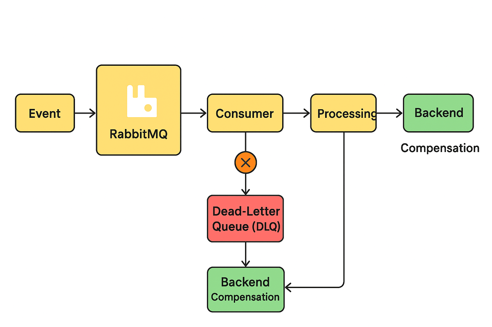

***整理：ChatGPT（2025-12-15）***

在学习 RabbitMQ 的过程中，我们通常会先从教程入手，例如 Spring AMQP 的 Pub-Sub 和 Fanout 示例。本文从工程实践角度讲解 RabbitMQ 在真实项目中的作用，并进一步介绍“后台补偿”机制，帮助你理解如何在生产系统中使用 MQ 提升稳定性和可维护性。

## 一、RabbitMQ 的核心作用

一句话概括：

> **RabbitMQ = 系统解耦 + 异步处理 + 流量缓冲器**

换句话说，它解决的是：

1. 系统耦合过紧
2. 接口耗时长
3. 高峰流量冲击
4. 失败无法处理

------

## 二、没有 RabbitMQ 的问题

以电商下单为例：

```
public void createOrder(OrderDTO dto) {
    orderService.save(dto);          // 下单
    stockService.deduct(dto);        // 扣库存
    paymentService.pay(dto);         // 支付
    deliveryService.ship(dto);       // 发货
    smsService.send(dto);            // 发短信
    emailService.send(dto);          // 发邮件
}
```

缺点：

- 接口慢（累积耗时 5~10 秒）
- 任一步失败，整体失败
- 新增功能需要改核心代码
- 高峰期系统可能崩溃

------

## 三、引入 RabbitMQ 后的改造

核心思想：

> **下单 = 核心业务 + 发布事件**
>  后续处理交给 MQ 异步完成

### 架构示意

```
用户请求
   │
   ▼
【订单服务】 - 创建订单 + 发送 MQ 消息
   │
   ▼
┌────────── RabbitMQ ──────────┐
│   Exchange: order.events     │
└───────────┬───────┬─────────┘
            │       │
            ▼       ▼
     【库存服务】 【通知服务】
            │       │
            ▼       ▼
        扣库存   发短信 / 邮件
```

**RabbitMQ 消息流与后台补偿示意图**


------

## 四、各服务职责

### 1️⃣ 订单服务（Producer）

只关心：

- 核心业务完成
- 消息发送成功

```
rabbitTemplate.convertAndSend("order.events", "order.created", orderId);
```

------

### 2️⃣ 库存服务（Consumer）

- 异步消费
- 慢一点也没关系
- 失败可重试

```
@RabbitListener(queues = "stock.queue")
public void deductStock(Long orderId) { ... }
```

------

### 3️⃣ 通知服务（Consumer）

- 发短信、邮件
- 可增加新消费者而无需修改订单服务

```
@RabbitListener(queues = "notify.queue")
public void notifyUser(Long orderId) { ... }
```

------

## 五、常用配置在项目中的作用

| 配置                            | 工程作用                                     |
| ------------------------------- | -------------------------------------------- |
| `prefetch`                      | 一次最多拉取多少条消息，防止服务被压垮       |
| `concurrency / max-concurrency` | 消费者数量可动态扩展，应对高峰               |
| `acknowledge-mode: manual`      | 处理完成后确认消息，失败可重试或进入死信队列 |

------

## 六、高峰流量处理

秒杀或活动场景：

```
1 秒 5 万单
```

**解决方案：**

- 请求进入 MQ 队列，服务慢慢消费
- MQ 成为系统缓冲区
- 并发消费者 + prefetch 控制消费速度

------

## 七、失败处理机制

### 消息失败处理流程

```
下单成功 ✔
短信失败 → MQ 重试
           → 死信队列（DLQ）
           → 后台补偿
```

------

## 八、后台补偿是什么？

> **后台补偿 = 人或程序，在自动重试失败后，把消息补做一遍**

### 为什么需要

- MQ 自动重试有限次数
- 重试仍失败时，不能默认放弃
- 某些操作需要人工判断（如支付/发货异常）

------

### 补偿方式

1. **后台管理页面**
    人工查看失败列表 → 手动重试或修复
2. **定时任务自动补偿**
    定时扫描失败记录 → 再次发送 MQ 或调用服务
3. **重新投递到 MQ**
    死信队列 → 程序重投原队列

------

### MQ 重试 vs 后台补偿

| 对比 | MQ 重试  | 后台补偿    |
| ---- | -------- | ----------- |
| 时机 | 立刻     | 延迟        |
| 方式 | 自动     | 人工 / 定时 |
| 次数 | 有上限   | 可控        |
| 目的 | 短暂失败 | 长期失败    |

------

## 九、总结

RabbitMQ 在实际项目中的价值：

1. **解耦系统** → 新增/修改消费者不影响生产者
2. **异步处理** → 核心业务快速返回
3. **削峰填谷** → 高峰期缓冲请求
4. **容错机制** → 重试 + 死信队列 + 后台补偿
5. **广播 / 分发** → Fanout / Topic 消息

> **核心理念：**
>  “事情已经发生，后续慢慢处理；机器没搞定的事，后台补回来。”